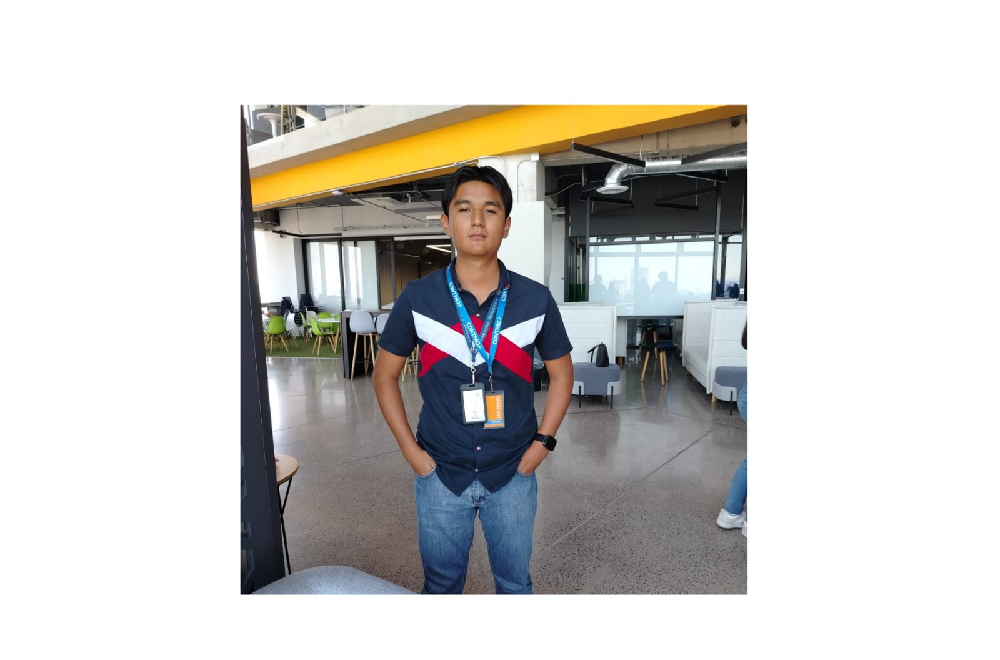
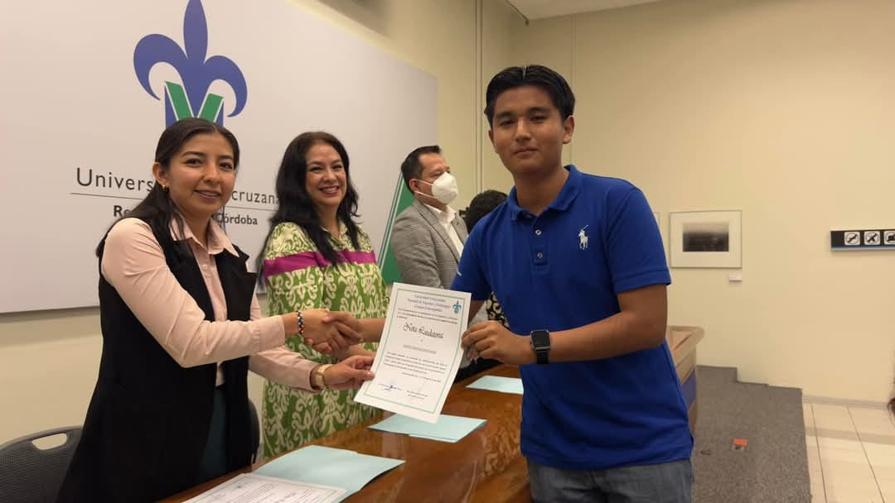
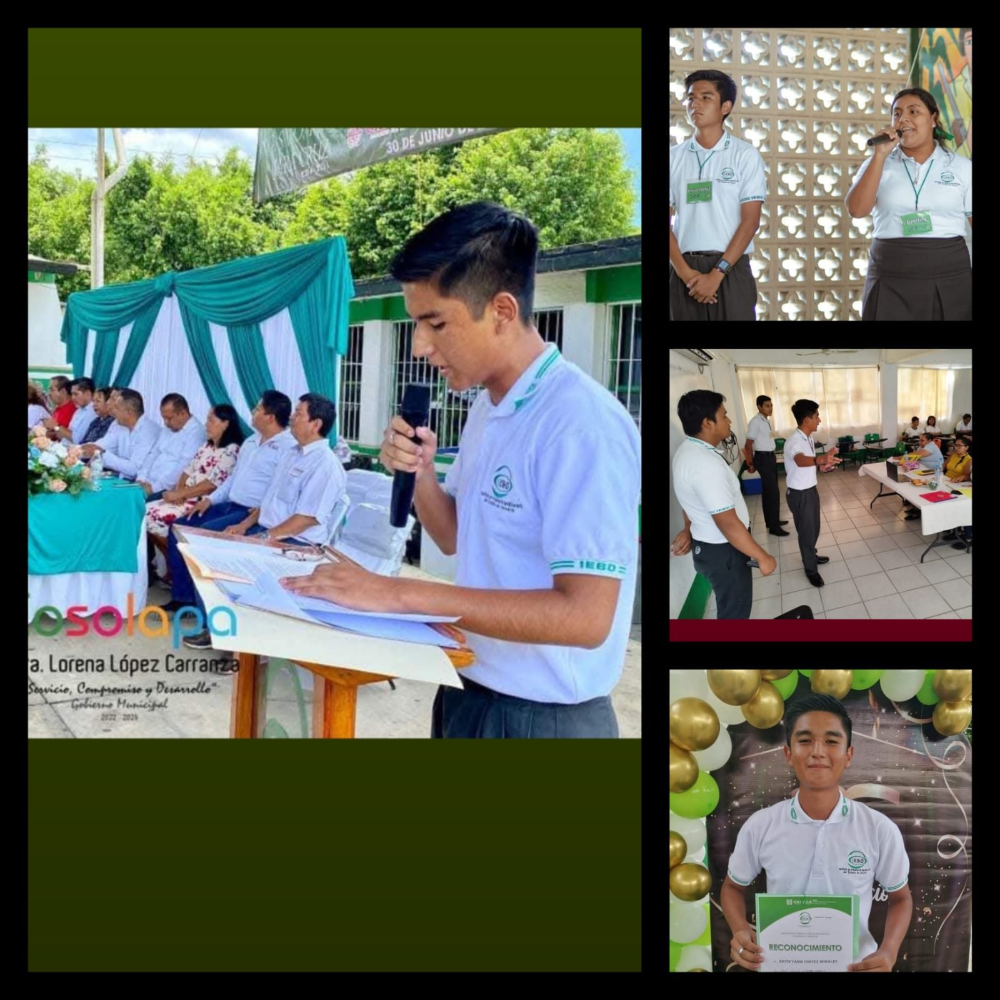

# SitioWebPersonal
<!DOCTYPE html>
<html lang="es">
<head>
  <meta charset="UTF-8" />
  <meta name="viewport" content="width=device-width, initial-scale=1" />
  <title>Web de Yahir</title>

  <link href="https://cdn.jsdelivr.net/npm/bootstrap@5.3.3/dist/css/bootstrap.min.css" rel="stylesheet" />

  
</head>
<body>

  <nav class="navbar navbar-expand-lg navbar-dark bg-primary">
    

      <a class="navbar-brand" href="#">🟢Web de Yahir🟢</a>

      

      <button class="navbar-toggler" type="button" data-bs-toggle="collapse" data-bs-target="#navbarNav">
        
      </button>
      

        <ul class="navbar-nav ms-auto">
          <li class="nav-item"><a class="nav-link" href="#personal">Personal</a></li>
          <li class="nav-item"><a class="nav-link" href="#academica">Académica</a></li>
          <li class="nav-item"><a class="nav-link" href="#experiencias">Experiencias</a></li>
          <li class="nav-item"><a class="nav-link" href="#aprendizajes">Aprendizajes</a></li>
          <li class="nav-item"><a class="nav-link" href="#contacto">Contacto</a></li>
        </ul>
      

    

  </nav>
  <section class="section bg-white">
    

      <h1 class="mb-4">¡Hola! Bienvenido al sitio web de Yahir👋</h1>
      

        Es un gusto tenerte por aquí. A continuación te presento información sobre mí, pasajes y experiencias académicas, además de distintos medios para contactarme.
        

        Para mayor comodidad, en la esquina superior derecha puedes acceder directamente al apartado informativo de tu interés. 
    

  </section>
 
  <section id="personal" class="section">
    

      <h2 class="section-title text-center">Información Personal📝</h2>
      

        

          
          
        

        

         
          
<strong>Nombre completo:</strong> Kevin Yahir Cortez Morales

          
<strong>Edad:</strong> 20 años

          
<strong>Fecha de nacimiento:</strong> 20 de Abril del 2005

          
<strong>Lugar de origen:</strong> Cosolapa, Oaxaca.

        

      

    

  </section>

  
  <section id="academica" class="section">
    

      <h2 class="section-title text-center">Información Académica✍🏽</h2>
      

        

          
          
        

        

          
          <ul>
            <li><strong>Universidad:</strong> Universidad Veracruzana (2023 - 2028)</li>
            <li><strong>Facultad:</strong> Negocios y Tecnologías.</li>
            <li><strong>Región:</strong> Córdoba - Orizaba</li>
            <li><strong>Programa educativo:</strong> Tecnologías de información en las organizaciones</li>
            <li><strong>Semestre actual y grupo:</strong> 4° - 401</li>
            
             

            
            <h4>Trayectoria previa</h4>
            <li><strong>Preparatoria:</strong> Instituto de Estudios de Bachillerato del Estado de Oaxaca (IEBO) Plantel 001 (2020 - 2023)</li>
            <li><strong>Secundaría:</strong> Escuela Secundaria Técnica Número 53 (2017 - 2020)</li>
            <li><strong>Primaria:</strong> Escuela Primaria Gabriel Lucio (2011 - 2017)</li>
            <li><strong>Preescolar:</strong> Preescolar Frida Kahlo Calderón (2008 - 2011)</li>
             

            <h4>Demás...</h4>
            <li><strong>Certificado:</strong> Cómputo básico - Capacitate</li>
            <li><strong>Curso:</strong> Crear una app - PruébaT</li>
            <li><strong>Curso:</strong> Hablar en público - PruébaT</li>
            <li><strong>Idiomas:</strong> Inglés Intermedio I (Cursando actualmente - C.I. Orizaba)</li>
          </ul>
        

      

    

  </section>

 
  <section id="experiencias" class="section">
    

      <h2 class="section-title text-center">Participaciones destacadas🌟</h2>
      

        

          
          
        

        

          

            

              <h5 class="card-title">IEBOLOGÍA</h5>
              
"IEBOLOGÍA" fue el nombre de un proyecto educativo que impulsaba fomentar el aprendizaje colaborativo entre los estudiantes, además de promover el uso de la tecnología dentro de las instalaciones del IEBO 001. Junto a 2 compañeros más, creamos y el establecimos todos los detalles acerca del proyecto. La organización y el plan de financiamiento fue de los aspectos más complejos en los que recuerdo, me tocó trabajar directamente. 

              
<small class="text-muted">El impacto del proyecto fue limitado a las instalaciones del bacchillerato en el que cursé</small>

            

            

              <h5 class="card-title">Oratoria</h5>
              
Desde 5° de primaria incursioné en esta arte de la palabra, ahí representé a mi primaria a nivel zona, gané y obtuve mi pase al concurso regional en donde conservo un grato recuerdo de la experiencia en general. Nuevamente, en 2° año de secundaria, representé a mi secundaria a nivel zona y finalmente en la preparatoria gané el consurso interno, sin embargo, no existió una competición más allá para representar a mi plantel

              
<small class="text-muted">Considero que la habilidad de hablar frente a un cierto público y la comunicación efectiva es fundamental para el desarrollo personal y profesional, más dentro del área de la tecnología.</small>

            

            

              <h5 class="card-title">CEKE Conmutación</h5>
              
Fue el nombre de un proyecto con impacto social, no lucrativo, el cual buscaba mejorar la comunicación y el entendimiento entre diferentes comunidades a través de talleres y actividades interactivas. Ofrecer apoyo de parte de estudiantes a un sector de la comunidad en situación de vulnerabilidad o desconocimiento del tema

              
<small class="text-muted">La gestión, desarrollo y ejecución de proyectos son de las prácticas comunes dentro del área tecnológica</small>

            

            
          

          
          

        

      

    

  </section>

  <section id="aprendizajes" class="section">
    

      <h2 class="section-title text-center">Aprendizajes Universitarios📚</h2>
      

        

          <iframe width="560" height="315" src="https://www.youtube.com/embed/Ju2yrHQn9VI?si=A9BD_0QelqqDOnYt" title="YouTube video player" frameborder="0" allow="accelerometer; autoplay; clipboard-write; encrypted-media; gyroscope; picture-in-picture; web-share" referrerpolicy="strict-origin-when-cross-origin" allowfullscreen></iframe>
        

        

          
            
Dentro de estos ya casi dos años en la Universidad Veracruzana he tenido significativas experiencias educativas que han contribuido a expandir mi conocimiento,
               aunque tomando en cuenta que no tan orientado aún a mi carrera, derivado del programa de estudios vigente en la carrera. Sin embargo, destaco el punto más importante por semestre que
              considero yo, ha sido más interesante para mi....

            <footer class="blockquote-footer" style="color: #ffffff;">
              <ul>
                <li><strong>Primero:</strong> La gestión de los recursos humanos, especificamente los filtros que son prudentes establecer ante el reclutamiento de personal,
                   además de la empatía que debe exitir dentro de un entorno laboral</li>
                <li><strong>Segundo:</strong> Requerimientos, conceptos, instalación y consultas de base de datos. Creación y gestión de base de datos, además de la realización de consultas </li>
                <li><strong>Tercero:</strong> Importancia de los sistemas de datos, variaciones y tipos dependiendo del contexto de una organización</li>
              
              </ul>
            </footer>
          </blockquote>
          
Y como sigue en tránsito el 4° semestre no destaco un punto en especifico aún, más sin embargo
            adjunto un video reciente, consecuencia de una actividad de la experiencia educativa 
             "Entorno Legal en los Negocios de T.I." en el cual se abarca el tema de la igualdad digital. Para la realización de este material
             se utilizaron multiples recursos tecnológicos y de software para la edición y difusión del material mencionado, además de adentrarse
             a normativas y leyes que toda persona debería conocer, más aún las personas profesionales en este medio, el tecnológico.

        

      

    

  </section>

  <section id="contacto" class="section">
    

      <h3 class="section-title">Medios de contacto📲</h3>
      

        
        
  
        
        
  
        
        
  
        
        

         
        <ul>
        
<strong>Correo institucional:</strong> zS23004879@estudiantes.uv.mx

        
<strong>Correo personal:</strong> cortezmoralesk55@gmail.com

        
<strong>Núm. Telefonico:</strong> 278-115-5197

        </ul>

      

    

  </section>
  

  <footer class="text-center">
    

      
Realizado por Kevin Yahir Cortez Morales.

      
Diseñado con plantillas de Bootstrap - Actividad de Diseño Web

      
&copy; 2025

    

  </footer>

  
  
  
  
</body>
</html>
